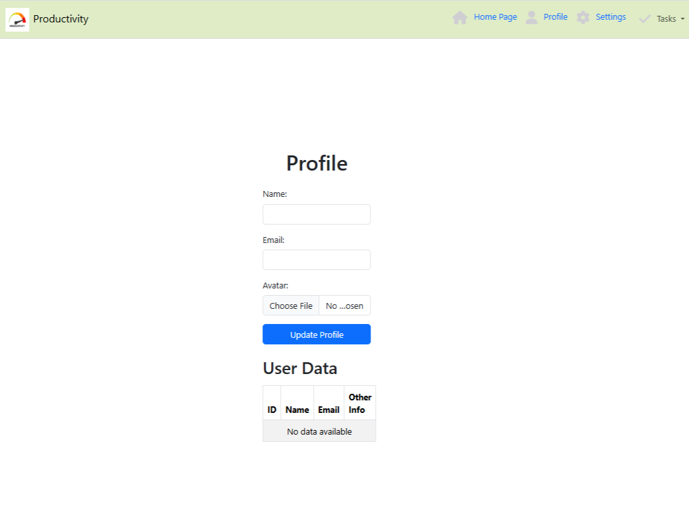
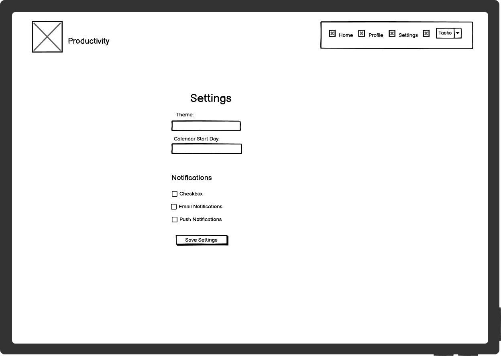
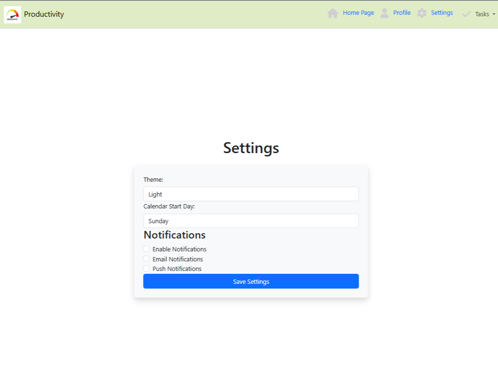
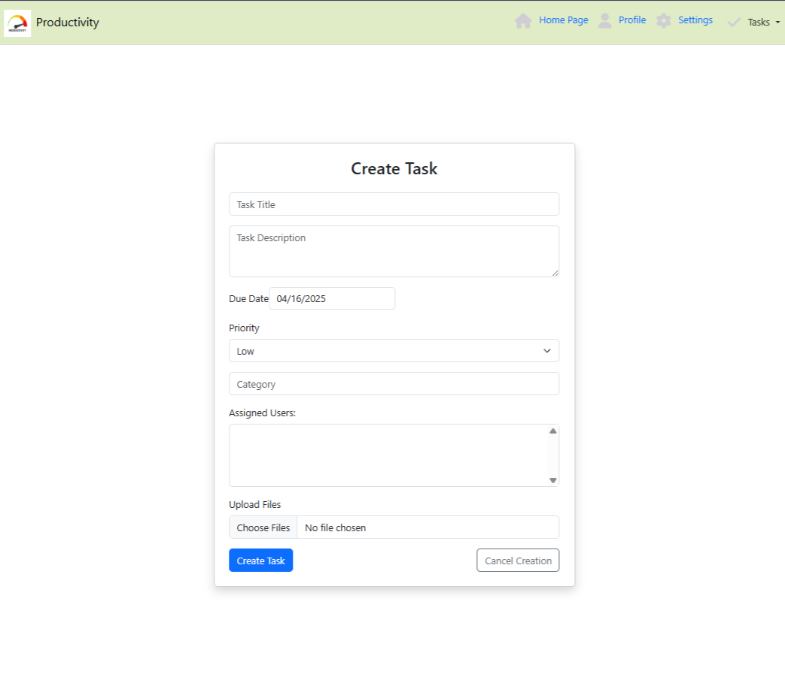
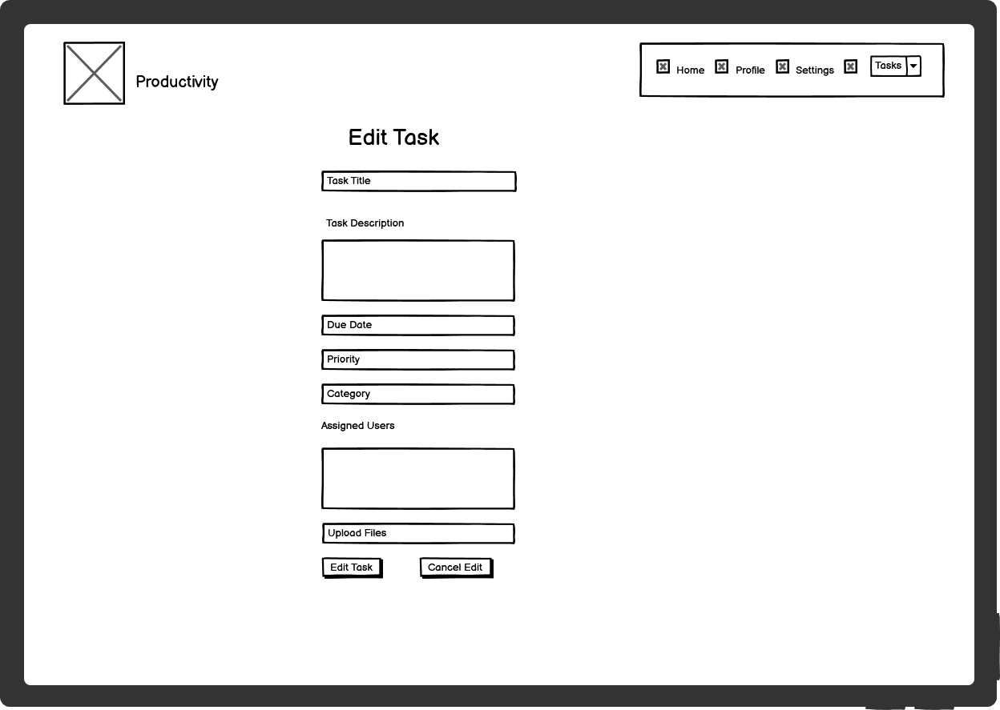

# 📅 Productivity App Project

The **Productivity App** project focuses on developing a **calendar-driven application** designed to help users organize their time efficiently. This **browser-based platform** allows users to create and manage **tasks and habits** effectively.
This application is built to ensure a **seamless user experience** in maintaining daily productivity through a clean, intuitive interface and smart task organization tools.

## Table of Contents

- [User Stories](#user-stories)
- [Technologies used](#technologies_used)
- [Design](#design)
  - [Color Scheme](#color-scheme)
  - [Typography](#typography)
  - [Wireframes](#wireframes)
  - [Reusable Component Design](#reusable-component-design)
  - [Accessibility](#accessibility)
  - [Agile Methodology](#agile-methodology)
- [Features](#features)
  - [Existing Features](#existing-features)
    - [General Features](#general-features)
    - [Navigation Bar](#navigation-bar)
    - [Home Page](#home-Page)
    - [Profile Page](#profile-page)
    - [Registration Page](#registration-page)
    - [Login Page](#login-page)
    - [Profile Page](#profile-page)
    - [Settings Page](#settings-page)
    - [Create Task Page](#creat-task-page)
    - [Edit Task Page](#edit-task-page)
    - [Task List Page](#task-list-page)
- [Break down of user stories into tasks](#break_down_of_user_stories_into_tasks)

- [Technologies Used](#technologies-used)

  - [Languages Used](#languages-used)
  - [Frameworks, Libraries & Programs Used](#frameworks-libraries--programs-used)
  - [Other Technologies Used](#other-technologies-used)

- [Deployment](#deployment)

  - [Heroku](#heroku)
  - [GitHub](#github)

- [Testing](#testing)

  - [Solved Bugs](#solved-bugs)
  - [Unfixed Bugs](#unfixed-bugs)

- [Credits](#credits)
  - [Tutorials & Code Used](#tutorials--code-used)
  - [Acknowledgments](#acknowledgments)

## User Stories for Productivity App

#### User Story 1: Account Creation & Login

**As a** new user,  
**I want to** create an account and log in,  
**so that** I can access the app and manage my tasks.

#### Acceptance Criteria:

- Allows users to register with a unique email and password.
- Enables the user to log in using an existing account.
- Provides feedback if the registration or login fails (e.g., email already exists, incorrect password).

---

#### User Story 2: Profile Management

**As a** registered user,  
**I want to** manage my profile,  
**so that** I can update my information or change my password.

#### Acceptance Criteria:

- Users can view and edit their profile information (name, profile picture, etc.).
- Users can change their password.
- Upon successful profile updates, the user receives a confirmation message.

---

#### User Story 3: Create Task

**As a** user,  
**I want to** create a task,  
**so that** I can keep track of what I need to do.

#### Acceptance Criteria:

- Provides users with a form to input task details (title, description, due date, priority, category).
- Allows users to attach files to the task.
- Saves the task and displays it in the user’s task list upon submission.

---

### User Story 4: Set Due Date

**As a** user,  
**I want to** set a due date for my tasks,  
**so that** I can manage my deadlines effectively.

#### Acceptance Criteria:

- Users can select a due date from a date picker.
- The due date is displayed on the task list and the task detail view.
- Tasks can be filtered based on due dates.

---

### User Story 5: Mark Task as Overdue

**As a** user,  
**I want to** mark tasks as overdue,  
**so that** I can prioritize tasks that are past their due date.

#### Acceptance Criteria:

- The application automatically marks the task as overdue if the current date exceeds the due date.
- Overdue tasks are visually distinct in the task list (e.g., using color coding).
- Users can manually adjust overdue statuses if necessary.

---

### User Story 6: Assign/Unassign Task Owners

**As a** user,  
**I want to** assign or unassign multiple owners to a task,  
**so that** I can collaborate with others effectively.

#### Acceptance Criteria:

- Users can select multiple users from a list to assign to a task.
- The assigned owners are displayed alongside the task details.

---

### User Story 7: Set Task Priority

**As a** user,  
**I want to** set a priority for each task (low, medium, high),  
**so that** I can focus on what’s most important.

#### Acceptance Criteria:

- Users can choose a priority level from a dropdown menu while creating/editing a task.
- The priority is visible in the task list, and users can filter tasks based on priority.

---

### User Story 8: Categorize Tasks

**As a** user,  
**I want to** categorize my tasks,  
**so that** I can organize them based on different projects or themes.

#### Acceptance Criteria:

- Users can assign categories (e.g., Work, Personal, Study) when creating/editing a task.
- Categories are displayed in the task list and can be used for filtering tasks within the app.

---

### User Story 9: Set Task State

**As a** user,  
**I want to** set the state of my task (open, in progress, done),  
**so that** I can track the status of each task at a glance.

#### Acceptance Criteria:

- Users can change the state of a task easily via dropdown options.
- The current state is clearly indicated in the task list and is updateable.

---

### User Story 10: Task Filtering

**As a** user,  
**I want to** filter my tasks based on due date, priority, category, and state,  
**so that** I can easily find the tasks I'm interested in.

#### Acceptance Criteria:

- The app provides filter options for users based on due date, priority, category, and status.
- Users can apply multiple filters at once.
- The task list updates dynamically to reflect the applied filters.

---

### User Story 11: Responsive Design

**As a** user,  
**I want to** access the application on multiple devices (desktop, tablet, mobile),  
**so that** I can manage my tasks wherever I am.

#### Acceptance Criteria:

- The app is fully responsive and functional across different screen sizes.
- Users should have a consistent experience with easy navigation and task management features.

## Break down of user stories into tasks

### User Story 1: Account Creation & Login

#### Tasks:

1. **Design Registration Form:** Create a form with fields for email and password.
2. **Implement Backend Registration Endpoint:** Create a Django Rest Framework endpoint for user registration.
3. **Handle Form Submission:** Add logic in React to capture user input and send a POST request to the registration endpoint.
4. **Display Error Messages:** Implement error handling for registration (e.g., unique email check).
5. **Design Login Form:** Create a form with fields for email and password.
6. **Implement Backend Login Endpoint:** Create a Django Rest Framework endpoint for user login.
7. **Handle Login Logic:** Add logic in React to capture user input, send a POST request, and handle authentication (using JWT or sessions).
8. **Redirect Upon Successful Login:** Implement redirection to the main dashboard after login.

---

### User Story 2: Profile Management

#### Tasks:

1. **Design Profile Page:** Create a UI layout for user profile information editing.
2. **Implement Backend Endpoint for Profile:** Create endpoints for retrieving and updating user profile data.
3. **Handle Profile Data Fetching:** Use React to fetch and display the user data.
4. **Implement Edit Functionality:** Add logic to capture changes and send PATCH requests to update user data.
5. **Display Success/Error Messages:** Show messages based on the success or failure of profile updates.

---

### User Story 3: Create Task

#### Tasks:

1. **Design Task Creation Form:** Create a user-friendly form for creating tasks (fields for title, description, due date, etc.).
2. **Implement Backend Task Creation Endpoint:** Create a Django REST Framework endpoint to handle task creation.
3. **Handle Form Submission:** Capture task data in React and send it via a POST request to the backend.
4. **Display Confirmation/Errors:** Show confirmation of success or errors during task creation.
5. **Update Task List:** Refresh the task list on the frontend after a successful creation.

---

### User Story 4: Set Due Date

#### Tasks:

1. **Integrate Date Picker:** Add a date picker component to the task creation form.
2. **Send Due Date with Task Creation/Update:** Ensure the due date is included in the requests for task creation or updates.
3. **Display Due Date in Task List:** Update the task list UI to show due dates for each task.

---

### User Story 5: Mark Task as Overdue

#### Tasks:

1. **Define Overdue Logic:** Implement logic in the backend to check if a task is overdue based on the current date and due date.
2. **Update Task Model:** Add an “is_overdue” field to the task model, if necessary.
3. **Display Visual Indicators:** Update UI to visually distinguish overdue tasks (e.g., through color coding).
4. **Implement Filter for Overdue Tasks:** Add functionality to filter the task list by overdue status.

---

### User Story 6: Assign/Unassign Task Owners

#### Tasks:

1. **Design Owner Assignment UI:** Create a UI component to display and select task owners.
2. **Implement Backend Logic for Assignment:** Create endpoints to handle assigning and unassigning owners.
3. **Capture Owner Selection:** Add logic in React to capture selected owners and send a PATCH request upon updates.
4. **Update UI with Assigned Owners:** Display assigned owners within task details.

---

### User Story 7: Set Task Priority

#### Tasks:

1. **Add Priority Field to Task Form:** Include a dropdown for priority selection (low, medium, high) in the task creation form.
2. **Implement Backend For Priority Handling:** Modify task model and backend logic to accept priority as part of the task data.
3. **Display Priority in Task List:** Ensure that priority information is displayed in the task overview.
4. **Implement Filter by Priority:** Enable filtering tasks based on priority level.

---

### User Story 8: Categorize Tasks

#### Tasks:

1. **Create Category Selection Field:** Add a field for categorizing tasks in the task creation form.
2. **Update Backend to Handle Categories:** Modify the task model and backend to allow category assignments.
3. **Display Task Categories:** Ensure categories are visible in both the task list and details.
4. **Implement Filter by Category:** Enable filtering of tasks based on selected categories.

---

### User Story 9: Set Task State

#### Tasks:

1. **Design State Selection UI:** Include a dropdown or buttons for task states (open, in progress, done).
2. **Implement Backend Handling for Task States:** Create logic in Django to update task status.
3. **Update UI Based on Task State:** Ensure the task list reflects the current states visually.
4. **Enable State Change Functionality:** Add functionality to change states easily from the task list.

---

### User Story 10: Task Filtering

#### Tasks:

1. **Design Filter UI:** Create a filter panel with options for due date, priority, category, and state.
2. **Implement Filter Logic in Backend:** Add filtering parameters to the task retrieval endpoint.
3. **Capture Selected Filters in React:** Handle filter selections and dynamically update the task list based on applied filters.

---

### User Story 11: Responsive Design

#### Tasks:

1. **Implement CSS Framework:** Integrate Bootstrap or similar CSS framework for responsive design.
2. **Test UI Across Devices:** Verify that all components function correctly on different screen sizes (desktop, tablet, mobile).
3. **Adjust Layouts:** Modify layouts as necessary to enhance usability on smaller screens.

---

### User Story 12: Search Functionality

#### Tasks:

1. **Add Search Bar UI:** Create a search input field at the top of the task list.
2. **Implement Search Logic in Backend:** Create a search endpoint that filters tasks based on keywords in titles/descriptions.
3. **Capture Search Input in React:** Handle the input from the search bar and send the search request to the backend.
4. **Display Search Results:** Dynamically update the task list to reflect search results.

## 🛠️ Technologies Used

### Front-End

- **HTML5** – Semantic markup for structuring content.
- **CSS3** – Responsive styling with modern layout techniques.
- **JavaScript (ES6+)** – Dynamic behavior and logic handling.
- **React.js** – Component-based UI development.
- **JSX** – Syntax extension for writing HTML in JavaScript.
- **Bootstrap** – Styling and responsive UI components.
- **Axios** – HTTP client for API requests.
- **React Router** – Client-side routing for SPA behavior.
- **ESLint** – Code linting to enforce code quality.
- **Git & GitHub** – Version control and collaborative development.
- **Heroku** – Front-End deployment to the cloud.

### Back-End

- **Python 3** – General-purpose programming for logic and data handling.
- **Django** – High-level web framework for building the application structure.
- **Django REST Framework (DRF)** – API creation with full CRUD capabilities.
- **PostgreSQL / SQLite** – Relational database for storing user and content data.
- **djoser / Simple JWT** – Token-based authentication.
- **Git & GitHub** – Back-End version control and project tracking.
- **Heroku** – Deployment of the API to a cloud platform.
- **Environment Variables** – Securing sensitive credentials and configuration.

### Tooling & Project Management

- **VS Code** – Source code editor with extensions for React and Django.
- **Postman / Insomnia** – API testing tools.
- **GitHub Projects** – Agile board for user stories and sprint planning.
- **Wireframes & Mockups** – UI/UX planning and design documentation.

## 🎨 Design

The design of this content-sharing platform focuses on accessibility, user experience, responsiveness, and clarity. The following practices and tools were used throughout the design and development phases:

### 🟡 Color Scheme

The application's color palette is designed to promote readability, engagement, and modern aesthetics. The chosen colors follow accessibility contrast guidelines and reflect a clean, professional tone suitable for content sharing:

- **Buttons**: #0d6efd and #198754 – Bootstrap primary and success (Buttons)
- **Background**: #f8f8f8; – Light Gray (Page background)
- **Text**: #212529 – Dark Charcoal (Primary Text)
- **Navbar**: #DFECC6 – Light Green (Navbar background)

These colors are applied consistently across components using Bootstrap’s utility classes and custom CSS variables.

---

### 🔤 Typography

To ensure readability and a modern look:

- **Font Family**: `"Roboto", sans-serif;`
- **Heading Font Sizes**: Scaled using Bootstrap's heading classes (`h1`–`h6`)
- **Body Font Size**: `1rem` with responsive scaling
- **Font Weight**: Used to distinguish hierarchy (e.g. `600` for headings, `400` for body text)

Typography is responsive and consistent across components to maintain design uniformity and accessibility.

---

### 🗂 Wireframes

Wireframes were designed during the planning phase to define layout, content structure, and user flow. They include:

- **HomePage** – Main landing page

- **Profile** – User profile page

- **Settings** – App and account settings

- **Tasks (Dropdown Menu)**:
  - Create Task 

  - Edit Task

  - Task List

Wireframes were created using Balsamiq and informed the React component structure and routing. All major interface elements were validated against the wireframes before implementation.

---

### Component-Based Architecture

- Built using **React**, the frontend is composed of modular, reusable components.
- Each component handles specific logic and layout responsibilities, following separation of concerns.
- Components use either **functional** or **class-based** approaches, where appropriate.

## Agile Methodology

- Due to time constraint Agile Methodoly was not applied

## Features

### Existing Features

#### 🔧General Features

- Create tasks with custom **due dates**
- Automatically mark tasks as **overdue**
- **Attach files** to tasks
- Assign/unassign **multiple task owners**
- Categorize tasks by **type or theme**
- Set **priority levels** (e.g., low, medium, high)
- Track task **states** (e.g., open, in progress, done)
- Apply **advanced filtering** to navigate task lists

### Navigation Bar

#### 🌐 NavBar Component

The `NavBar` component is a responsive, top-fixed navigation bar for the **Productivity App**, built using **React Bootstrap** and **React Router**. It provides users with intuitive access to the main sections of the application.

#### 🔗 Navigation Links

- **HomePage** – Main landing page
- **Profile** – User profile page
- **Settings** – App and account settings
- **Tasks (Dropdown Menu)**:
  - Create Task
  - Edit Task
  - Task List)

#### ⚙️ Key Features

- **Responsive Design**: Collapses into a hamburger menu on smaller screens
- **Auto-collapse Behavior**: Automatically closes the navbar on route changes or link clicks
- **Custom Styling**: Uses a CSS module (`NavBar.module.css`) for scoped styles
- **Icons**: Integrates **Font Awesome** icons for better UX
- **Branding**: Displays the app logo and name ("Productivity") in the top-left corner

The component also uses the `useLocation` hook from `react-router-dom` to detect route changes and control the navbar’s state accordingly.

### 🏠 HomePage Component

The `HomePage` component acts as the **landing page** for the Productivity App, providing users with a clean, modern introduction to the platform's purpose and benefits.

#### ✨ Features

- **Headline & Subtext**:

  - A bold, motivational headline: _"Stay Productive, Stay Ahead"_
  - Supporting text highlights the app's purpose — organizing life and enhancing collaboration.

- **Call-to-Action Buttons**:

  - **Get Started** – navigates users to the registration page.
  - **Login** – directs existing users to the login page.

- **Responsive Layout**:
  - Utilizes `Container`, `Row`, and `Col` from **React Bootstrap** for a fully responsive design.
  - Vertically and horizontally centers content using Bootstrap utility classes.

#### 🚀 Purpose

This component sets the tone for the application by welcoming users and providing them with clear actions to begin their productivity journey — whether by signing up or logging in.

### 👤 Profile Component

The `Profile` component allows users to **view and update their personal profile information** in an intuitive and user-friendly interface.

#### ✨ Features

- **Profile Information Display & Edit**:

  - Displays user's current `name`, `email`, and `avatar`.
  - Allows editing of name and email fields.
  - Supports avatar upload using a file input.

- **Profile Update Functionality**:

  - Sends a PUT request to update the user's profile on the backend.
  - Updates are handled via controlled form fields and state management.

- **User Data Table**:

  - Fetches and displays additional user-related data in a table format.
  - Table columns include `ID`, `Name`, `Email`, and `Other Info`.
  - Displays a message if no data is available.

- **Responsive Design**:
  - Centered layout using React Bootstrap `Container`, `Row`, and `Col`.
  - Form and table adapt gracefully across screen sizes.

#### 🚀 Purpose

This component offers a centralized profile management interface, allowing users to easily keep their information up to date and view key account data. It enhances user experience through an accessible, responsive, and functional design.

### ⚙️ Settings Component

The `Settings` component provides a customizable user preferences interface, allowing users to tailor the app experience to their needs.

#### ✨ Features

- **Theme Selection**:

  - Users can toggle between `Light` and `Dark` themes.

- **Calendar Configuration**:

  - Choose whether the calendar week starts on `Sunday` or `Monday`.

- **Notification Preferences**:

  - Enable or disable overall notifications.
  - Choose specific types like:
    - Email Notifications
    - Push Notifications

- **Data Fetch & Save**:

  - Automatically fetches saved settings from `/api/settings` when the component mounts.
  - Allows users to update and save preferences via a PUT request.

- **User Feedback**:

  - Displays success or error messages in an `Alert` component.

- **Responsive UI**:
  - Uses Bootstrap’s grid system to ensure layout adapts to different screen sizes.
  - Clean and accessible form UI with appropriate spacing, shadow, and padding.

#### 🚀 Purpose

This component enhances user control over their experience by offering configurable settings for appearance, scheduling, and communication preferences. It supports a more personalized and user-friendly app environment.
.

### 📝 CreateTask Component

The `CreateTask` component provides a user-friendly interface for creating new tasks within the productivity app.

#### ✨ Features

- **Form Fields**:

  - **Title**: Required text input for the task's name.
  - **Description**: Optional multi-line input for additional task details.
  - **Due Date**: Integrated date picker using `react-datepicker`.
  - **Priority**: Dropdown with options: `Low`, `Medium`, `High`.
  - **Category**: Text input for custom task categorization.
  - **Assigned Users**: Multi-select dropdown to assign the task to one or more users.
  - **File Upload**: Supports multiple file attachments.

- **Form Actions**:

  - `Create Task`: Submits the form via the `onSubmit` callback with all input values.
  - `Cancel Creation`: Triggers the `onCancel` callback without submitting.

- **Responsive UI**:
  - Wrapped in a `Card` with spacing and shadows for clean presentation.
  - Centered layout using Bootstrap's `Container`, `Row`, and `Col` components.
  - Optimized for mobile and desktop views.

#### 🚀 Purpose

Enables users to easily create detailed, collaborative tasks with due dates, priorities, and attachments—empowering productivity and team coordination.

### ✏️ EditTask Component

The `EditTask` component allows users to update and modify existing tasks through an intuitive form-based UI.

#### ✨ Features

- **Pre-filled Form Fields**:

  - Loads the task data into the form for easy editing.
  - Includes fields for title, description, due date, priority, category, assigned users, and file attachments.

- **Editable Fields**:

  - **Title**: Required field for task name.
  - **Description**: Optional multi-line input.
  - **Due Date**: Date picker with initial value from the task.
  - **Priority**: Select from Low, Medium, or High.
  - **Category**: Text input for organizing tasks.
  - **Assigned Users**: Multi-select to reassign task participants.
  - **Files**: Option to upload new files (existing files handling is customizable).

- **Actions**:

  - `Edit Task`: Submits the updated task data through the `onSubmit` handler.
  - `Cancel Edit`: Discards changes and triggers the `onCancel` callback.

- **Responsive Layout**:
  - Centered within a Bootstrap `Card`.
  - Styled with padding and shadow for a clean, modern UI.
  - Mobile and desktop friendly.

#### 🛠 Use Case

This component is designed to help users efficiently update tasks without needing to recreate them, making collaboration and task management smoother.

### 📝 TaskList Component

The `TaskList` component provides users with an interactive view of their tasks. It includes features for searching, filtering, sorting, and managing tasks.

#### ✨ Features

- **Search & Filter**:

  - **Search**: Allows users to search tasks by title or keyword.
  - **Category Filter**: Drop-down to filter tasks by category.
  - **Sort By**: Option to sort tasks by due date or priority.

- **Task Table**:

  - Displays a table of tasks with columns for Title, Due Date, Priority, Status, and Assigned Users.
  - Each task is clickable, revealing detailed information in a popup modal.

- **Task Details**:

  - Clicking a task opens a popup modal displaying:
    - Title, description, due date, category, priority, and status.
    - Action buttons to mark the task as complete, edit it, or close the modal.

- **Responsive Layout**:
  - The task list and task details modal are styled with Bootstrap for a responsive, clean interface.
  - The page adjusts to different screen sizes, making it suitable for both mobile and desktop users.

#### 🛠 Use Case

The `TaskList` component is designed for task management, allowing users to easily view, filter, and interact with tasks in a structured and efficient way. It is ideal for projects or productivity applications where task tracking and management are essential.

### Other Technologies Used

- Mention other relevant technologies integrated into the project.

## Deployment

### Heroku

- Description of the deployment process using Heroku.

### GitHub

- Information on how the project is managed and version-controlled with GitHub.

## Testing

### Solved Bugs

- List of bugs that have been addressed and resolved.

### Unfixed Bugs

- List of known issues that remain unfixed.

## Credits

### Tutorials & Code Used

- Acknowledge tutorials and code snippets referenced in the project.

### Acknowledgments

- Express thanks to contributors and resources that supported the project.
